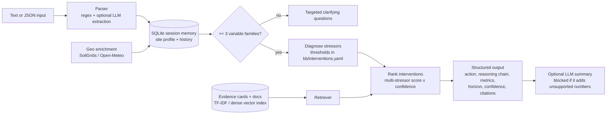

# AI Biodiversity Intelligence Agent

A conversational "AI environmental scientist" that diagnoses a site from soil, climate, land-use,
biodiversity and human-impact variables, and returns ranked, evidence-backed interventions.
It is **not an LLM wrapper**: diagnosis, ranking, citations and every number come from a
retrievable knowledge base and a rule engine. An LLM is optional and fenced in by a grounding guard.

## Architecture



| Module | Role |
|---|---|
| `kb/evidence.yaml` | 16 evidence cards (paper, DOI, finding, metrics, verification status). The only allowed source of numbers. |
| `kb/interventions.yaml` | Stressor thresholds, 9 interventions (preconditions, contraindications, mechanism, horizon, evidence ids), causal links. |
| `kb/docs/` | Drop PDFs/reports here; `python -m app.ingest` chunks and indexes them. |
| `app/knowledge.py` | Loads KB, checks every intervention cites existing evidence, builds hybrid index (TF-IDF always; sentence-transformers if installed). |
| `app/reasoning.py` | Diagnosis → ranking → reasoning chain → confidence. Also returns what it *rejected* and why. |
| `app/dialogue.py` | Clarifying questions, multi-turn memory, "why?" follow-ups, general KB questions. |
| `app/geo.py` | Bonus spatial input: fills missing SOC/pH/rainfall/temperature from coordinates (marked as estimated → lower confidence). |
| `app/llm.py` | Optional extraction + summary. Guard rejects any number not in cited cards or user data. |
| `app/main.py` | FastAPI: `POST /chat`, `GET /kb/search`, `GET /kb/evidence`, `GET /sessions/{id}`, `GET /health`, minimal UI at `/`. |

### How multi-metric reasoning works
1. Each stressor (low SOC, water-limited, monoculture, <20% native habitat, fragmentation, acidic soil, pesticide pressure, runoff to water) is detected from one or more variables, with a severity.
2. An intervention scores the sum of severities it relieves, plus a bonus for each extra stressor (so single-variable fixes lose), times a confidence weight.
3. Interactions change the answer, e.g. **water-limited + cover crop → rejected** (water competition), **forest + agroforestry → contraindicated** (SOC loss), **acidic pH → fixed first** (biology under-performs), **intercropping + habitat set-aside → paired** (land saved by LER > 1 pays for the 20% habitat target).

### Example (the brief's use case)
Input `{"soil_organic_carbon":"0.3%","rainfall":"low","crop":"monoculture wheat","region":"semi-arid"}` →
agroforestry (medium confidence), residue cover + reduced tillage, legume intercrop, 20% habitat set-aside;
cover crops explicitly **not** recommended, with the reason and source.

## Database schema (SQLite)
```sql
sessions(id TEXT PK, profile_json TEXT, last_recs_json TEXT, pending_questions_json TEXT, created_at, updated_at)
messages(id INTEGER PK, session_id TEXT FK, role TEXT CHECK(role IN ('user','assistant')), content TEXT, created_at)
```
Knowledge is versioned as YAML in git (reviewable in PRs); the vector index is rebuilt from it at start-up.

## Local setup
```bash
python -m venv .venv && source .venv/bin/activate
pip install -r requirements-dev.txt          # optional: pip install -r requirements-optional.txt
python -m app.ingest                          # build index
uvicorn app.main:app --reload                 # http://localhost:8000
python -m app.cli --json "$(cat examples/semi_arid_wheat.json)"   # terminal chat
pytest -q
```
Docker: `docker build -t bio-agent . && docker run -p 8000:8000 bio-agent`

API example:
```bash
curl -X POST localhost:8000/chat -H 'Content-Type: application/json' \
  -d '{"message":"Biodiversity is declining on my land"}'
```

## CI/CD
GitHub Actions (`.github/workflows/ci.yml`): ruff lint → build index → pytest (18 tests, offline) → Docker build.
On push to `main`, a Render deploy hook (repo secret `RENDER_DEPLOY_HOOK`) redeploys the Docker service defined in `render.yaml`.
No secrets are stored in the repo; `ANTHROPIC_API_KEY` is optional and set only in the host's dashboard.

## Scientific honesty rules (built in, and tested)
- Every printed effect size must appear in a cited evidence card (`test_kb_integrity...`).
- Cards marked `needs-check` are flagged "(verify figure)" in output.
- Working thresholds that are engineering choices (e.g. 500 mm rainfall) are labelled as such, not presented as science.
- Estimated inputs (from coordinates) lower confidence; missing inputs trigger questions instead of guesses.
- The brief's sample line ("legume cover crops → SOC +15–25% in 2–3 years (FAO)") is not reproduced: cover-crop SOC gains in meta-analyses are slower and usually under ~16%, and in semi-arid sites cover crops can cost yield through water use.

## Limitations
Knowledge base is small and hand-curated (quality over quantity); thresholds are global, not regional; SoilGrids is sometimes unavailable, in which case the agent asks instead.
